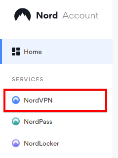
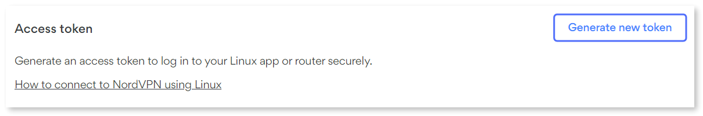

# 🎬 Ultimate Media Server Setup

> **A comprehensive guide to setting up a complete media server infrastructure with Docker, VPN protection, and automated download clients.**

---

<details>
<summary>
<h2> Docker Installation</h2>
</summary>

```bash
# Update system
sudo apt update

# Install prerequisites
sudo apt install apt-transport-https ca-certificates curl software-properties-common

# Add Docker's official GPG key
sudo apt-get update
sudo apt-get install ca-certificates curl
sudo install -m 0755 -d /etc/apt/keyrings
sudo curl -fsSL https://download.docker.com/linux/ubuntu/gpg -o /etc/apt/keyrings/docker.asc
sudo chmod a+r /etc/apt/keyrings/docker.asc

# Add repository
echo \
  "deb [arch=$(dpkg --print-architecture) signed-by=/etc/apt/keyrings/docker.asc] https://download.docker.com/linux/ubuntu \
  $(. /etc/os-release && echo "${UBUNTU_CODENAME:-$VERSION_CODENAME}") stable" | \
  sudo tee /etc/apt/sources.list.d/docker.list > /dev/null
sudo apt-get update

# Install Docker
sudo apt-get install docker-ce docker-ce-cli containerd.io docker-buildx-plugin docker-compose-plugin

# Verify installation
sudo docker run hello-world
```

</details>


<details>
<summary>
<h2> Dockge Setup</h2>
</summary>

### Installation
```bash
# Create directories that store your stacks and stores Dockge's stack
cd /
sudo mkdir -p /opt/stacks /opt/dockge
sudo chown -R $USER:$USER /opt
cd /opt/dockge

# Download the compose.yaml
curl https://raw.githubusercontent.com/louislam/dockge/master/compose.yaml --output compose.yaml

# Start the server
docker compose up -d

# If you are using docker-compose V1 or Podman
# docker-compose up -d
```

**Access:** [`http://localhost:5001`](http://localhost:5001)

</details>


<details>
<summary>
<h2> NordVPN + Gluetun Setup</h2>
</summary>

## Gluetun
   
   ```yaml
   gluetun:
       image: qmcgaw/gluetun
       container_name: gluetun
       hostname: gluetun
         - NET_ADMIN
       devices:
         - /dev/net/tun:/dev/net/tun
       ports:
         - 8085:8085 # qbittorrent
       volumes:
         - /home/homenet/src/stacks/gluetun:/gluetun
       environment:
         - VPN_SERVICE_PROVIDER=nordvpn
         - VPN_TYPE=wireguard
         - WIREGUARD_PRIVATE_KEY=[YOUR_PRIVATE_KEY] # wg show nordlynx private-key
         - WIREGUARD_ADDRESSES=[YOUR_INET_IP] # ifconfig nordlynx
         - TZ=Denver
         - UPDATER_PERIOD=24h
       restart: unless-stopped
   ```

### Install NordVPN Client

```bash
sh <(curl -sSf https://downloads.nordcdn.com/apps/linux/install.sh)
sudo apt install wireguard net-tools
```

### Authentication Setup

### 🖥️ Authentication Setup

#### For Non-GUI Users (Headless Servers)

1. **Access Your NordVPN Account**
   - Navigate to [Nord Account Dashboard](https://my.nordaccount.com/?nv_tri=TC_7789917667737013_1756501610170&nv_trs=1756501610171_1756502282877_1_147&_gl=1*749t8t*FPAU*MTUxMjQ1MDUzMy4xNzU2NTAxNjE0*_ga*NzU1MTQyMTYwLjE3NTY1MDE2MTA.*_ga_LEXMJ1N516*czE3NTY1MDE2MTAkbzEkZzEkdDE3NTY1MDIyODIkajYwJGwwJGgw&_ga=2.208263835.861224087.1756501721-755142160.1756501610)

2. **Locate NordVPN Service**
   - Find NordVPN under the Services menu
   
   

3. **Generate Access Token**
   - Locate the "Access token" tab
   - Click on "Generate new token"
   
   

4. **Login with Token**
   - Copy the generated token and run:
   ```bash
   # For headless servers
   nordvpn login --token [YOUR_TOKEN]
   
   # For GUI systems
   nordvpn login
   ```
3. **Configure permissions:**
   ```bash
   sudo usermod -aG nordvpn $USER
   nordvpn connect
   ```

---

### Extract VPN Configuration for Gluetun

```bash
# Get private key
sudo wg show nordlynx private-key

# Get IP address
ifconfig nordlynx
```

Copy the private key and IP address (e.g., `10.5.0.2/16`) to your Gluetun Docker configuration.


</details>


<details>
<summary>
<h2> Download Client Setup</h2>
</summary>

```yaml
qbittorrent:
    image: lscr.io/linuxserver/qbittorrent
    container_name: qbittorrent
    network_mode: service:gluetun
    environment:
      - PUID=1000
      - PGID=1000
      - TZ=America/New_York
      - WEBUI_PORT=8085
    volumes:
      - ./qbittorrent:/config
      - /mnt/media/Downloads:/downloads
    restart: unless-stopped
    depends_on:
      - gluetun
```
### QBittorrent Configuration

**Access:** `127.0.0.1:8085` | **NZBget:** `127.0.0.1:6789`

#### Initial Login

1. Find temporary password in Dockge logs: `admin / [generated_password]`
2. Change username/password in settings after login

---

### Recommended Torrent Trackers

<details>
<summary>
🔗 <strong>Click to expand tracker list</strong> (Copy and paste into QBittorrent settings) [Source](https://newtrackon.com/list)
</summary>

```
udp://tracker.opentrackr.org:1337/announce
udp://p4p.arenabg.com:1337/announce
udp://d40969.acod.regrucolo.ru:6969/announce
udp://evan.im:6969/announce
https://tracker.jdx3.org:443/announce
udp://retracker.lanta.me:2710/announce
http://lucke.fenesisu.moe:6969/announce
http://tracker.renfei.net:8080/announce
https://tracker.expli.top:443/announce
https://tr.nyacat.pw:443/announce
udp://tracker.ducks.party:1984/announce
udp://extracker.dahrkael.net:6969/announce
http://ipv4.rer.lol:2710/announce
udp://tracker.tvunderground.org.ru:3218/announce
udp://tracker.kmzs123.cn:17272/announce
https://tracker.alaskantf.com:443/announce
udp://tracker.dler.com:6969/announce
http://bt.okmp3.ru:2710/announce
udp://tracker.torrent.eu.org:451/announce
http://tracker.mywaifu.best:6969/announce
udp://bandito.byterunner.io:6969/announce
udp://tracker.plx.im:6969/announce
udp://open.stealth.si:80/announce
https://tracker.moeblog.cn:443/announce
https://tracker.yemekyedim.com:443/announce
udp://tracker.fnix.net:6969/announce
udp://martin-gebhardt.eu:25/announce
udp://tracker.valete.tf:9999/announce
http://tracker.bt4g.com:2095/announce
udp://retracker01-msk-virt.corbina.net:80/announce
udp://tracker.srv00.com:6969/announce
udp://open.demonii.com:1337/announce
udp://www.torrent.eu.org:451/announce
udp://bt.bontal.net:6969/announce
udp://tracker.torrust-demo.com:6969/announce
http://open.trackerlist.xyz:80/announce
udp://tracker.gigantino.net:6969/announce
http://torrent.hificode.in:6969/announce
udp://tracker.therarbg.to:6969/announce
udp://opentracker.io:6969/announce
udp://1c.premierzal.ru:6969/announce
http://0123456789nonexistent.com:80/announce
udp://tracker.cloudbase.store:1333/announce
http://shubt.net:2710/announce
udp://tracker.zupix.online:1333/announce
udp://tracker.rescuecrew7.com:1337/announce
udp://tracker.startwork.cv:1337/announce
udp://tracker.skillindia.site:6969/announce
udp://tracker.hifitechindia.com:6969/announce
udp://tracker.bitcoinindia.space:6969/announce
udp://ttk2.nbaonlineservice.com:6969/announce
https://tracker.zhuqiy.top:443/announce
https://2.tracker.eu.org:443/announce
udp://tracker.hifimarket.in:2710/announce
https://4.tracker.eu.org:443/announce
https://3.tracker.eu.org:443/announce
udp://tr4ck3r.duckdns.org:6969/announce
udp://6ahddutb1ucc3cp.ru:6969/announce
https://shahidrazi.online:443/announce

```

</details>

**Add to QBittorrent:** Settings → BitTorrent → "Automatically add these trackers to new downloads"

</details>

<details>
<summary>
<h2>   Setting up the Arrrrs ☠️</h2>
</summary>

Setup for **Prowlarr**, **Radarr**, and **Sonarr**.

### 1. Deploy Stack
1. Access [Dockge](http://localhost:5001) → Create New Stack
2. Upload `arrs.docker-compose.yaml` and deploy

**Services:** Prowlarr `:9697` | Radarr `:7878` | Sonarr `:8989`

### 2. Set Permissions

```bash
# Create directories
sudo mkdir -p /mnt/media/{Downloads,Prowlarr,Sonarr,Radarr}
sudo mkdir -p /mnt/media/Prowlarr/{Config,Backup}
sudo mkdir -p /mnt/media/Sonarr/{Config,Backup,tvshows}
sudo mkdir -p /mnt/media/Radarr/{Config,Movies}
sudo mkdir -p /mnt/media/Downloads/{complete,incomplete}

# Set permissions
sudo chown -R $USER:$USER /mnt/media
sudo chmod -R 755 /mnt/media
sudo chmod -R 775 /mnt/media/Downloads

# Check your user ID (note uid/gid for Docker config)
id $USER
```

### 3. Prowlarr Configuration

**Access:** [`http://localhost:9697`](http://localhost:9697)

1. **Settings** → **Apps** → Connect Radarr & Sonarr (use API keys)
2. **Settings** → **Apps** → Connect QBittorrent 
3. **Indexers** → Add public indexers (1337x, RARBG, TPB, YTS, EZTV)
4. **Optional:** Configure FlareSolverr for Cloudflare bypass

### 4. Radarr Configuration

**Access:** [http://localhost:7878](http://localhost:7878)

1. **Settings** → **Media Management** → Add Root Folder: `/data/movies`
2. **Settings** → **Download Clients** → Add QBittorrent (category: `movies`)
3. **Settings** → **Profiles** → Configure quality preferences

### 5. Sonarr Configuration

**Access:** [http://localhost:8989](http://localhost:8989)

1. **Settings** → **Media Management** → Add Root Folder: `/data/tvshows`
2. **Settings** → **Media Management** → Enable folder management options
3. **Settings** → **Download Clients** → Add QBittorrent (category: `tv`)
4. **Settings** → **Profiles** → Configure quality preferences

</details>


<details>
<summary>
<h2> Jellyfin Media Server</h2>
</summary>


### Docker Compose

```yaml
services:
  jellyfin:
    image: jellyfin/jellyfin:latest
    container_name: jellyfin
    labels:
      - com.centurylinklabs.watchtower.enable=false
    user: 0:0
    volumes:
      - ./data/config:/config
      - ./data/cache:/cache      
      - type: bind
        source: /mnt/media/Radarr/Movies
        target: /media/Radarr
      - type: bind
        source: /mnt/media/Sonarr/tvshows
        target: /media/Sonarr
      - type: bind
        source: /mnt/media/Genres
        target: /media/Genres
    restart: unless-stopped
    extra_hosts:
      - host.docker.internal:host-gateway
    networks:
      - jellyfin-network
    ports:
      - 8096:8096
```

## Jellyfin Setup

**Access:** [`http://localhost:8096`](http://localhost:8096)

1. **Language Selection** & **Admin Account** setup
2. **Add Media Libraries:**
   - Movies: `/media/Radarr`
   - TV Shows: `/media/Sonarr`

Once you've setup and logged into Jellyfin, go back to Dockge and add these binds to Jellyfin volumes.

```yaml
      - /opt/jellyfin-setup/images/favicon.png:/jellyfin/jellyfin-web/favicon.png
      - /opt/jellyfin-setup/images/bc8d51405ec040305a87.ico:/jellyfin/jellyfin-web/bc8d51405ec040305a87.ico
      - /opt/jellyfin-setup/images/banner-dark.png:/jellyfin/jellyfin-web/assets/img/banner-dark.png
      - /opt/jellyfin-setup/images/banner-light.png:/jellyfin/jellyfin-web/assets/img/banner-light.png
      - /opt/jellyfin-setup/images/touchicon.png:/jellyfin/jellyfin-web/touchicon.png
      - /opt/jellyfin-setup/images/touchicon72.png:/jellyfin/jellyfin-web/touchicon72.png
      - /opt/jellyfin-setup/images/touchicon114.png:/jellyfin/jellyfin-web/touchicon114.png
      - /opt/jellyfin-setup/images/touchicon144.png:/jellyfin/jellyfin-web/touchicon144.png
      - /opt/jellyfin-setup/images/touchicon512.png:/jellyfin/jellyfin-web/touchicon512.png
      - /opt/jellyfin-setup/code/index.html:/jellyfin/jellyfin-web/index.html
      - /opt/jellyfin-setup/code/main.jellyfin.bundle.js:/jellyfin/jellyfin-web/main.jellyfin.bundle.js
      - /opt/jellyfin-setup/code/main.jellyfin.7d6eaeb032d03eb0ae47.css:/jellyfin/jellyfin-web/main.jellyfin.7d6eaeb032d03eb0ae47.css
      - /opt/jellyfin-setup/code/home-html.8ce38bc7d6dc073656d4.chunk.js:/jellyfin/jellyfin-web/home-html.8ce38bc7d6dc073656d4.chunk.js
      - /opt/jellyfin-setup/code/73233.d08d0c3a593dcbf1c7c7.chunk.js:/jellyfin/jellyfin-web/73233.d08d0c3a593dcbf1c7c7.chunk.js
```

Restart Jellyfin.

## Genres Setup (Linux Only)

```bash
# Download Python and venv
sudo apt update && sudo apt install python3 python3-pip python3-venv -y

# Navigate to auto-genre directory and setup virtual environment
cd /opt/jellyfin-setup/auto-genre
python3 -m venv venv
source venv/bin/activate
pip install -r requirements.txt
```

Change Jellyfin Username and Password in .env file. 

```bash 
# /auto-genre/.env

USERNAME=root #change me
PASSWORD=password #change me
```

Run the create_genre_symlinks.py script.
```bash
./create_genre_symlinks.py
```

## Jellyfin Custom CSS

Go to Dashboard -> General -> Custom CSS code and add:

```css
@import url(https://cdn.jsdelivr.net/gh/apensotti/ZestyTheme@main/theme.css);
@import url('https://cdn.jsdelivr.net/gh/stpnwf/ZestyTheme@latest/colorschemes/gray.css');

.adminDrawerLogo img { content: url(https://imagedelivery.net/ZYTNwtC8cUrRhA9tP_rjhg/9c952c1e-f37a-445e-ef74-609621ae6600/public) !important; } imgLogoIcon { content: url(https://imagedelivery.net/ZYTNwtC8cUrRhA9tP_rjhg/9c952c1e-f37a-445e-ef74-609621ae6600/public) !important; } .pageTitleWithLogo { background-image: url(https://imagedelivery.net/ZYTNwtC8cUrRhA9tP_rjhg/9c952c1e-f37a-445e-ef74-609621ae6600/public) !important; }
```

Click ```F12``` and right click the page refresh button and click ```Empty Cache and Hard Reload```  

## Plugins

Go to Dashboard -> Catalog:

Install the following plugins:

``` 
AniDB
AniList
Artwork
Chapter Segments Provider
Fanart
OMDb
Open Subtitles
Playback Reporting
Reports
Session Cleaner
Studio Images
Subtitle Extract
TMDb
TMDb Boxsets
TVmaze
TheTVDB
Trakt
```

Now go to the setting icon next to ```Catalog``` and click ```+```

```
Repository Name: Merge Versions
Repository URL: https://raw.githubusercontent.com/danieladov/JellyfinPluginManifest/master/manifest.json
```

Go back to catalog and install ```Merge Versions```

Go to Dashboard and click ```Restart```, wait and refresh.

Finally go to Dashboard -> Scheduled Tasks run TMDb ```Scan library for new box sets```

</details>

<details>
<summary>
<h2> Jellyseerr Requests</h2>
</summary>

```yaml
services:
  jellyseerr:
    image: fallenbagel/jellyseerr:latest
    container_name: jellyseerr
    environment:
      - LOG_LEVEL=debug
      - TZ=America/New_York
      - PORT=5055
    ports:
      - 5055:5055
    volumes:
      - /config:/app/config
    restart: unless-stopped
```

Setting up Jellyseer:
1. Choose Jellyfin
2. Add Jellyfin IP (Leave Base URL blank)
3. Input Jellyfin Username and Password
4. Click ```Sync Libraries``` and select ONLY ```Movies``` and ```Shows```
5. Radarr Setup:
   - Server Name: Radarr
   - Hostname or IP: radarr
   - Port: 7878
   - API Key: (from Radarr settings)
   - Base URL: (leave blank)
   - Quality Profile: (select preferred)
   - Root Folder: /data/movies
6. Sonarr Setup:
   - Server Name: Sonarr
   - Hostname or IP: sonarr
   - Port: 8989
   - API Key: (from Sonarr settings)
   - Base URL: (leave blank)
   - Quality Profile: (select preferred)
   - Root Folder: /data/tv

</details>
